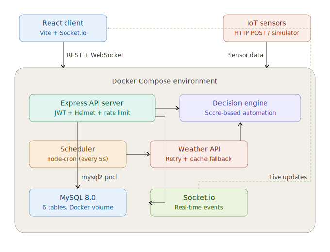

# Smart Shade — Campus Shade Automation System

A full-stack IoT-inspired system that automates window shade positions across a university campus using real-time weather data, configurable sensor input, and a weighted scoring algorithm. Built as a final project at Holon Institute of Technology (HIT).



## How It Works

The system follows a **sensor → decision → actuator** loop that runs continuously:

1. **Data ingestion** — Every 5 seconds, the scheduler fetches live weather from OpenWeatherMap (temperature, cloud cover, sunrise/sunset). Light intensity is estimated using a solar elevation model (0–80,000 lux). Rooms in simulation mode use injected data instead.
2. **Decision engine** — A configurable weighted algorithm (60% temperature, 40% light intensity) calculates a score between 0.0 and 1.0 for each room. The score snaps to one of five stepped positions (0%, 25%, 50%, 75%, 100% closed). Extreme conditions (storm, heat ≥35°C, cold ≤10°C) bypass the formula and trigger immediate full closure.
3. **Hysteresis** — Changes under 5% are ignored to prevent shade twitching. The system also tracks the last action type per room to avoid redundant updates.
4. **Actuation** — The computed position (0–100%) is written to the database and broadcast to all connected clients via WebSocket instantly.
5. **Manual override** — Users can take control of any shade at any time. Manual overrides are timestamped and respected by the scheduler until the user explicitly reverts to AUTO.

## Tech Stack

| Layer | Technology |
|---|---|
| Frontend | React 19, Vite (Rolldown), React Router v7, Socket.io Client, Recharts, Chart.js, Axios |
| Backend | Node.js, Express 5, Socket.io, node-cron, JWT (jsonwebtoken), Multer, Nodemailer |
| Database | MySQL 8.0 with connection pooling (mysql2) |
| External API | OpenWeatherMap — with retry, exponential backoff, and cache fallback |
| Infrastructure | Docker Compose (MySQL + Node.js containers), volume sync for development |
| Security | Helmet (HTTP headers), express-rate-limit, JWT authentication, role-based access control (RBAC) |
| Testing | Jest, Supertest — Decision Engine unit tests + Weather Service resilience tests |

## Features

### Real-Time Automation Pipeline
A node-cron scheduler evaluates all rooms every 5 seconds. It fetches live weather, runs each room through the decision engine, updates the database, and pushes changes to every connected browser via Socket.io — no page refresh needed.

### Interactive Campus Map
An SVG-overlay map of the campus with draggable room pins. Pin colors reflect each room's current shade position in real time (green = open, red = closed, orange = partial). Admins have a floating toolbar to add new rooms (click to place), drag existing pins to new positions, or delete rooms — all with instant persistence.

### Per-Room Dashboard
Clicking a room pin opens a detailed control panel with:
- **Shade status** — Current position percentage and mode (AUTO/MANUAL/OPEN/CLOSED) with color-coded display.
- **Manual control slider** — A 0–100% range input to override the shade position. Supports OPEN, CLOSED, and any position in between.
- **Auto revert button** — Returns the room to automatic algorithm control, clearing the manual override timestamp.

### Visual Sensor Editor
Admins can upload a room layout image and place sensor markers on it with a visual drag-and-drop editor. Sensor badges display live temperature readings with color-coded backgrounds (blue = cold, green = optimal, red = hot). Supports adding, moving, and deleting sensor markers with save/cancel workflow.

### AI Simulation Mode
Each room can be switched to simulation mode independently. A control panel lets you inject custom temperature (0–50°C), light intensity (0–80,000 lux), and weather condition (Clear/Cloudy/Rain/Storm) to test the decision engine's response without waiting for real weather changes. A "Stop Simulation" button reverts to live weather data.

### Smart Algorithm Dashboard
A persistent top bar displays the global algorithm state in real time via WebSocket (no polling): current temperature, cloud cover, light intensity, the computed score with a visual progress bar, and the algorithm's current decision with its reasoning. The bar updates live as weather changes.

### Activity Log (Live Feed)
A sidebar showing all system events streamed in real time via Socket.io. Distinct event types with color-coded backgrounds and icons:
- **EXTREME_HEAT** / **EXTREME_COLD** — Temperature threshold breaches
- **STORM** — Rain/storm protection triggered
- **OPENED** / **CLOSED** — Manual or automatic shade state changes
- **AUTO** — Algorithm-driven partial adjustments
- **NEW_ALERT** — Maintenance issue reported
- **NEW_SCHEDULE** — Automation task created
- **ROOM_CREATED** / **ROOM_DELETED** — Area management events
- **SENSOR_UPDATE** — Raw sensor data received
- **SCHEDULE_OPEN** / **SCHEDULE_CLOSE** — Scheduled automation executed

### Global Campus Control
Admin and maintenance users can set the entire campus to AUTO, OPEN, or CLOSED with a single click from the header bar. Includes confirmation dialog to prevent accidental changes. Global actions are logged to the Activity Log.

### Maintenance Alert System
A full issue-tracking workflow: any authenticated user can report a problem (selecting room, description, and priority level from Low to Critical). Admins can assign maintenance staff to alerts. Both admins and maintenance users can mark issues as resolved. Alerts are displayed with color-coded priority borders and role-based action buttons.

### Automation Scheduler
Admins and maintenance users can create time-based rules (e.g., "Close Classroom 216 at 18:00 every day"). The scheduler executes these rules automatically at the specified time, updates the shade state, and logs the event to the Activity Log in real time.

### User Management
Admin-only panel for creating and deleting system users. Supports three roles: Admin (full access), Maintenance (shade control + alert handling), Planner (view + report). Users table displays role badges with color coding.

### Forgot / Reset Password
Users can request a password reset by entering their email address. A one-time reset link (valid for 1 hour) is sent via SMTP email. The link opens a reset form that validates the token, hashes the new password with bcrypt, and invalidates the token on use. Login accepts both username and email.

### Historical Sensor Charts
Per-room history charts powered by Recharts. Data points are color-coded by shade state at recording time (green dot = shade was open, red dot = closed, orange = partial). Custom tooltips show exact temperature and shade position on hover. Data is fetched on demand when the history modal opens.

### Room Image Upload
Admins can upload layout images (floor plans, photos) for each room. Images are stored via Multer with filename sanitization and 5MB size limit. The uploaded image serves as the background for the visual sensor editor. Fallback image displayed if upload fails.

### Weather API Resilience
The weather service includes three layers of fault tolerance:
1. **Retry with exponential backoff** — Up to 3 attempts with increasing delays (1s → 2s → 4s)
2. **Smart retry logic** — Client errors (4xx) are not retried (e.g., invalid API key)
3. **Cache fallback** — Last successful API response is cached in memory (10-minute TTL). If all retries fail, cached data is returned. If no cache exists, generated default values are used.

### Security
- **JWT authentication** — Tokens issued on login, verified on every protected route, 24-hour expiry
- **Role-based access control** — Middleware checks user role before allowing sensitive operations
- **Forgot/reset password** — Cryptographically random token (32 bytes), 1-hour expiry, single-use, sent via SMTP
- **Helmet** — Sets secure HTTP headers automatically
- **Rate limiting** — 1000 requests per minute per IP on all API routes
- **File upload validation** — Image-only MIME type filter with 5MB size cap
- **Login persistence** — User session stored in localStorage with token

## How to Run

**Prerequisites:** Docker Desktop, Node.js 18+

```bash
# 1. Clone the repository
git clone https://github.com/Tomer98/My-Shade-Project.git
cd My-Shade-Project

# 2. Start the backend (MySQL + Node.js server)
docker compose up --build
# Wait for: "Server running on http://localhost:3001"

# 3. In a new terminal, start the frontend
cd client
npm install
npm run dev
# Open: http://localhost:5173
```

**Default login credentials:**

| Username | Email | Role | Password |
|---|---|---|---|
| Tom | bareltom33@gmail.com | Admin | password123 |
| Alice | alice@campus.edu | Admin | password123 |
| Bob | bob@campus.edu | Maintenance | password123 |
| Dana | dana@campus.edu | Planner | password123 |

### Running the Multi-Room Simulator

To demo the full automation pipeline without real IoT hardware, open a third terminal:

```bash
cd server
node scripts/multi_simulator.js
```

This generates random weather scenarios (summer heat, winter sun, extreme glare, neutral day) for multiple rooms every 4 seconds. Watch the Activity Log and campus map update in real time as the decision engine responds to each scenario.

### Running Tests

```bash
cd server
npm test
```

Runs 23 tests across two suites:
- **Decision Engine** (19 tests) — Extreme conditions, standard scoring, stepped thresholds, edge cases
- **Weather Service** (4 tests) — Successful calls, retry behavior, client error handling, cache fallback

## Project Structure

```
My-Shade-Project/
├── client/                          # React frontend (Vite)
│   ├── public/                      # Static assets (campus map, room images)
│   ├── src/
│   │   ├── components/
│   │   │   ├── ActivityLog.jsx      # Real-time event sidebar (WebSocket)
│   │   │   ├── AlertsSystem.jsx     # Issue reporting & tracking
│   │   │   ├── CampusMap.jsx        # Interactive campus map with admin tools
│   │   │   ├── ForgotPassword.jsx   # Password reset request form
│   │   │   ├── Login.jsx            # JWT authentication form (username or email)
│   │   │   ├── ResetPassword.jsx    # New password form (token-based)
│   │   │   ├── RoomDashboard.jsx    # Per-room control panel & simulation
│   │   │   ├── SchedulerPanel.jsx   # Time-based automation manager
│   │   │   ├── SensorChart.jsx      # Historical data visualization (Recharts)
│   │   │   ├── SensorMap.jsx        # Room layout with draggable sensor badges
│   │   │   ├── SmartDashboard.jsx   # Algorithm status ticker (WebSocket)
│   │   │   └── UserManagement.jsx   # Admin user CRUD panel
│   │   ├── context/
│   │   │   └── NotificationContext.jsx  # Global toast notification state
│   │   ├── utils/
│   │   │   ├── auth.js              # Shared JWT header helper
│   │   │   └── getShadeColor.js     # Shade position → color mapping
│   │   ├── App.jsx                  # Main application shell & state management
│   │   ├── App.css                  # Global layout styles
│   │   ├── config.js                # API base URL configuration
│   │   ├── socket.js                # Shared WebSocket connection (single instance)
│   │   └── main.jsx                 # React entry point
│   └── package.json
├── server/                          # Node.js backend (Express 5)
│   ├── config/
│   │   ├── db.js                    # MySQL connection pool (async/await)
│   │   └── automation.js            # Algorithm weights & thresholds (configurable)
│   ├── controllers/
│   │   ├── areaController.js        # Room CRUD, shade state, simulation, image upload
│   │   ├── alertController.js       # Alert lifecycle (create → assign → resolve)
│   │   ├── authController.js        # JWT login, forgot password, reset password
│   │   ├── schedulerController.js   # Schedule CRUD with log sync
│   │   ├── sensorController.js      # Sensor data ingestion & history queries
│   │   └── userController.js        # User management (admin only)
│   ├── middleware/
│   │   ├── auth.js                  # JWT verification + role-based access control
│   │   └── upload.js                # Multer config (image filter, 5MB limit)
│   ├── routes/
│   │   ├── areaRoutes.js            # /api/areas — rooms & shade control
│   │   ├── alertRoutes.js           # /api/alerts — maintenance issues
│   │   ├── authRoutes.js            # /api/auth — login, forgot/reset password
│   │   ├── schedulerRoutes.js       # /api/schedules — automation rules
│   │   ├── sensorRoutes.js          # /api/sensors — data ingestion & logs
│   │   └── userRoutes.js            # /api/users — user management
│   ├── services/
│   │   ├── decisionEngine.js        # Pure scoring logic (extracted for testability)
│   │   ├── emailService.js          # Nodemailer SMTP client for transactional email
│   │   ├── scheduler.js             # Cron-based automation orchestrator
│   │   └── weatherService.js        # OpenWeatherMap client (retry + backoff + cache)
│   ├── database/
│   │   └── schema.sql               # Full database schema (6 tables, seed data)
│   ├── __tests__/
│   │   ├── decisionEngine.test.js   # 19 algorithm unit tests
│   │   └── weatherService.test.js   # 4 resilience & retry tests
│   ├── uploads/                     # User-uploaded room images (Docker volume)
│   ├── scripts/
│   │   └── multi_simulator.js       # Multi-room IoT sensor simulator
│   ├── test.http                    # REST Client API test suite
│   ├── Dockerfile                   # Node.js 18 Alpine container
│   ├── .dockerignore
│   ├── .env                         # Environment secrets (gitignored)
│   ├── index.js                     # Server entry point (Express + Socket.io)
│   └── package.json
├── docker-compose.yml               # MySQL + Node.js orchestration
├── .gitignore
├── .gitattributes                   # LF normalization for Docker/Linux
└── README.md
```

## Database Schema

| Table | Purpose | Key Fields |
|---|---|---|
| **users** | Authentication & roles | username, password, email, role (admin/maintenance/planner), reset_token, reset_token_expires |
| **areas** | Room definitions & state | room, shade_state, current_position, map_coordinates, sensor_positions, simulation cache fields |
| **logs** | Activity history | area_id, temperature, light_intensity, current_position, action_type |
| **weather_logs** | AI telemetry | temp, light_level, clouds, score, decision, reason |
| **schedules** | Time-based automation | area_id, execution_time, action_type (OPEN/CLOSE/AUTO), is_active |
| **alerts** | Maintenance tracking | area_id, created_by, assigned_to, priority (Low→Critical), status (Open→Resolved) |

## API Endpoints

| Method | Route | Description | Access |
|---|---|---|---|
| POST | /api/auth/login | Authenticate and receive JWT | Public |
| POST | /api/auth/forgot-password | Generate and email a password reset link | Public |
| POST | /api/auth/reset-password | Validate token and set new password | Public |
| GET | /api/areas | Get all rooms with state | Authenticated |
| POST | /api/areas | Create a new room (with optional image) | Admin |
| PUT | /api/areas/:id/state | Manual shade control | Authenticated |
| PUT | /api/areas/global/state | Set entire campus to AUTO/OPEN/CLOSED | Admin/Maintenance |
| PUT | /api/areas/:id/map-coordinates | Update pin position on map | Admin |
| PUT | /api/areas/:id/sensor-positions | Update sensor layout | Admin |
| PUT | /api/areas/:id/simulation | Update simulation parameters | Authenticated |
| POST | /api/areas/:id/image | Upload room layout image | Admin |
| DELETE | /api/areas/:id | Delete a room and related data | Admin |
| POST | /api/sensors | Ingest raw sensor data | Authenticated |
| GET | /api/sensors/latest | Latest global algorithm metrics | Authenticated |
| GET | /api/sensors/logs | Global activity log (last 10) | Authenticated |
| GET | /api/sensors/history/:id | Room sensor history (last 20) | Authenticated |
| GET | /api/alerts | List all alerts with details | Authenticated |
| POST | /api/alerts | Report an issue | Authenticated |
| PUT | /api/alerts/:id | Update status / assign staff | Admin/Maintenance |
| DELETE | /api/alerts/:id | Delete an alert | Admin |
| GET | /api/schedules | List all schedules | Authenticated |
| POST | /api/schedules | Create a schedule | Admin/Maintenance |
| DELETE | /api/schedules/:id | Delete a schedule | Admin/Maintenance |
| GET | /api/users | List all users (no passwords) | Admin |
| POST | /api/users | Create a new user | Admin |
| DELETE | /api/users/:id | Delete a user | Admin |

## Scalability Considerations

The current architecture handles a single-campus deployment. To scale further:

- **Message queue (Kafka/RabbitMQ)** — Decouple sensor ingestion from decision processing. Sensors publish to a topic; the decision engine consumes asynchronously.
- **Redis** — Replace the in-memory action cache with Redis for shared state across multiple Node.js instances. Also useful for caching weather API responses with TTL.
- **Socket.io Redis adapter** — Enable WebSocket broadcasting across horizontally scaled server instances.
- **Kubernetes** — Deploy each service (API, scheduler, weather poller) as independent containers with auto-scaling policies.
- **Time-series database (InfluxDB/TimescaleDB)** — Migrate logs and weather_logs for better write throughput and time-range query performance.
- **API Gateway** — Centralize rate limiting, authentication, and routing behind Kong or AWS API Gateway.

## Future Improvements

- CI/CD pipeline (GitHub Actions → Docker Hub → cloud deployment)
- Integration tests covering full API request flows
- Mobile-responsive CSS layout
- Historical analytics dashboard with weekly/monthly trend aggregation
- Multi-campus support with campus selection UI
